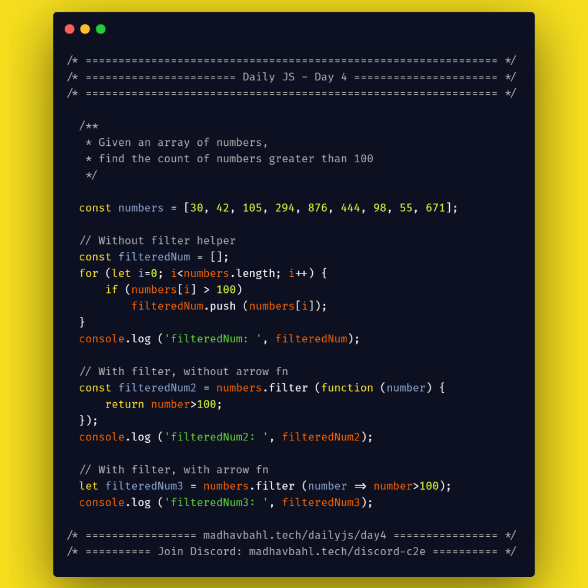

# Day 4: The `filter` helper


As the name suggests, the `filter` helper is used to filter out some specific elements from an array of elements.

It creates a new array from the elements of the original array which pass the given criteria.

The criteria is generally given as a condition in the iterator function.

Unlike `find` helper, `filter` returns an arrow of elements which pass the criteria.

## Syntax

```js
array.filter(function(currentValue, index, arr), thisValue)
```

- **currentValue**: Required.
    The value of the current element
- **index**: Optional.
    The array index of the current element
- **arr**: Optional.
    The array object the current element belongs to
- **thisValue**: Optional.
    The array object the current element belongs to

## [A simple example](./1.js)

**Given an array of numbers, find the count of numbers greater than 100**

```js
const numbers = [30, 42, 105, 294, 876, 444, 98, 55, 671];

// Without filter helper
const filteredNum = [];
for (let i=0; i<numbers.length; i++) {
    if (numbers[i] > 100)
        filteredNum.push (numbers[i]);
}
console.log ('filteredNum: ', filteredNum);

// With filter, without arrow fn
const filteredNum2 = numbers.filter (function (number) {
    return number>100;
});
console.log ('filteredNum2: ', filteredNum2);

// With filter, with arrow fn
let filteredNum3 = numbers.filter (number => number>100);
console.log ('filteredNum3: ', filteredNum3);
```

## [Example](./2.js)

**Extract the information of students from an array having information about people**

```js
var people = [
    { name: 'John', isStudent: false },
    { name: 'Mark', isStudent: true },
    { name: 'Kepler', isStudent: false },
    { name: 'Stan', isStudent: true },
    { name: 'Ben', isStudent: true },
];

let students = [];

// Without filter helper
for (let i=0; i<people.length; i++) {
    if (people[i].isStudent)    students.push(people[i]);
}
console.log ('Students1: ', students);

// With filter without arrow fn
let students3 = people.filter(function (person) {
    return person.isStudent;
})
console.log ('Students2: ', students2);

// With filter with arrow fn
let students3 = people.filter(person => person.isStudent)
console.log ('Students3: ', students3);
```

## Homework for you

1. Make a vegetable shop, given the data about vegetables, their quantity and price, allow user to query the available vegetables based on quantity and budget.

2. Filter out the invalid roll numbers  (roll numbers which are greater than 100 or less than 0), and return the list of correct roll numbers

3. Given an array of student information, find the list of students eligible for final exams based on their attendance (>75%)

4. From a list of words find the words having more than 5 letters.

## Download your free eBook

<a href="./ebook.pdf" style="display: inline-block; margin: 0.3em; padding: 1.2em 5em; overflow: hidden; position: relative; text-decoration: none; text-transform: uppercase; border-radius: 3px;  -webkit-transition: 0.3s; -moz-transition: 0.3s; -ms-transition: 0.3s; -o-transition: 0.3s;  transition: 0.3s; box-shadow: 0 2px 10px rgba(0,0,0,0.5); border: none;  font-size: 15px; text-align: center;   background-color: #03A9F4; color: white; margin-left: 38%;" download class="btn-rounded-white">Claim Your Free PDF Here</a>

## Carbon code sample

